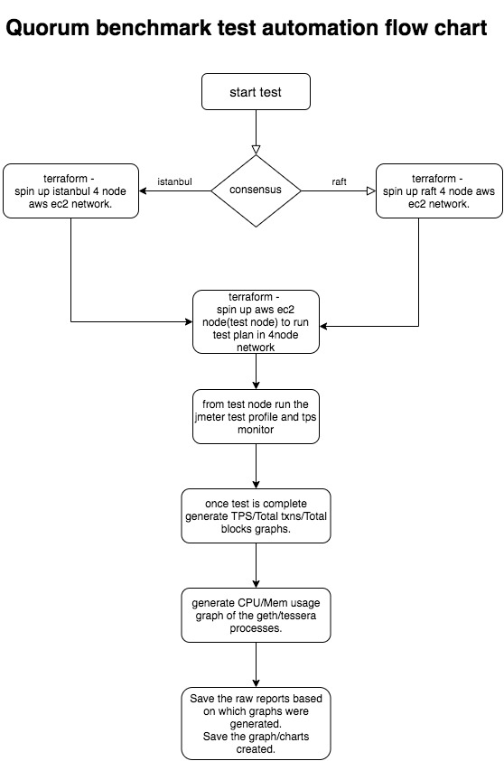
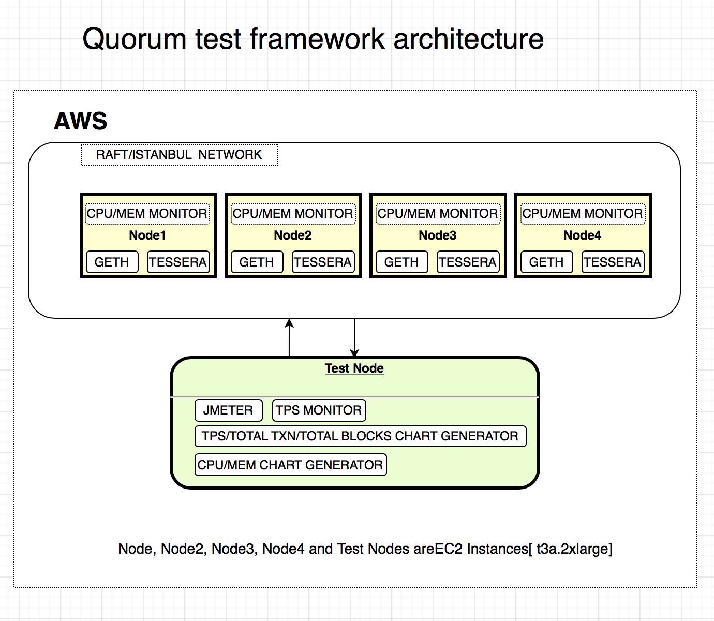

## TEST AUTOMATION

 

 

## List of tasks

#### 1. Jmeter - create test profile
Create test plan in Jmeter that can run different transaction types in a loop i.e, in each iteration a combination of different transaction types should be sent to geth client. The following transaction types should be covered.
* Public contract creation
* Public contract - state change
* Private contract creation
* Private contract - state change
* value transfer

#### 2. Terraform - spin up 4 node Raft/istanbul network
* Create Terraform code to spin up 4 node network with Raft/istanbul consensus. 
Each node should be EC2 instance `t3a.2xlarge` with at least 250G storage.
Each node should have a `geth` and `tessera` instance. 
terraform should generate a config file with public IP of all the 4 nodes should be generated and used as input to the test node to run the test plans. 

* Create Terraform code to spin up a node to run the Jmeter test plan. The node should be EC2 instance `t3a.2xlarge` with at least 50G storage.
The node should have Jmeter and chainhammer available. 

#### 3. Chart generation tool
This tool should generate the following charts once Jmeter test plan has finished running.
* TPS over time
* Total transactions over time
* Total blocks over time
* CPU and memory usage of geth and java processes

The tool should transform time input to start from `00:00` and allow flexibility to aggregate statistics at second/minute level.
If data from two test environments are provided the tool should generate single chart with data from one environment overlaying on the other.