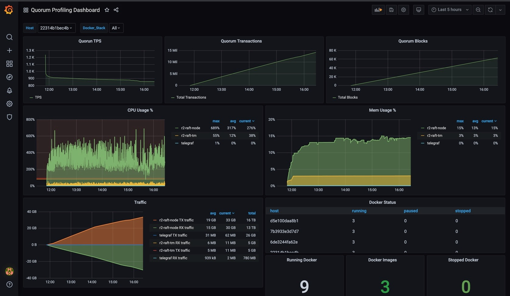
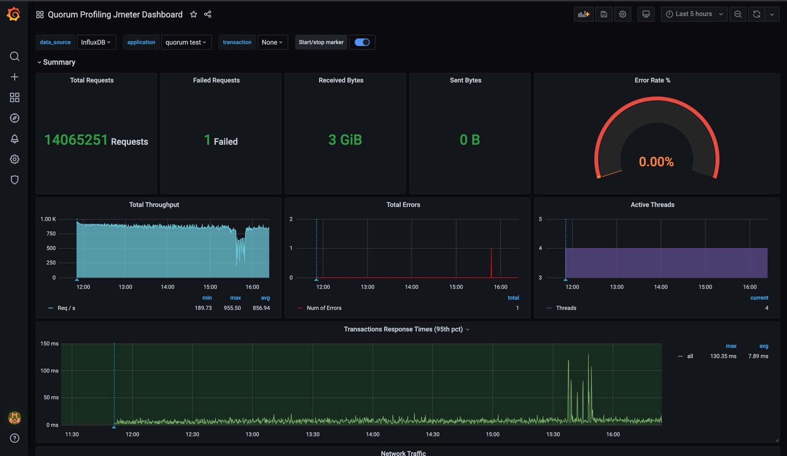

# Quorum Profiling
Quorum Profiling is a toolset built for the purpose of running stress tests on networks running on Quorum and measure/monitor the TPS and other benchmarking parameters at network level. The tests are fired using `Jmeter`. The tools can be used in different scenarios as described below:

* **Scenario 1 - Spin up a Quorum network in AWS and execute stress test:** 
In this scenario, the tool can be used to spin up a quorum network in AWS and run some tests using `Jmeter` tests and measure/monitor TPS, CPU & Memory usage metrics. A dashboard is also available to monitor the progress of `Jmeter` tests. Refer [testing Quorum in AWS](stresstest-aws/) for more details on how to use it.

* **Scenario 2 - Executing stress test on an existing Quorum network with Jmeter test profile:**
In case there is an existing Quorum network already running and the sole purpose is to execute certain stress test scenarios, the `Jmeter` test profiles available within the tool can be executed as required. Refer [testing Quorum with JMeter Test Profiles](jmeter-test/) for more details on how to use it.

* **Scenario 3 - Measuring TPS in an existing Quorum network:**
The toolset include a TPS monitoring tool which can be used to measure/monitor the TPS of an existing Quorum network
Refer [measuring TPS in Quorum](tps-monitor/) for more details on how to use it.

* **Scenario 4 - Using the tool for local testing:**
The tool can be used for development purpose as well to execute tests on local Quorum network. Refer [running locally](scripts/) for more details on how to use it.

## Prerequisites for test execution
The prerequisites for each of the above scenario is as listed below:
* **Scenario 1:**
> * Terraform runtime - Can be downloaded from [HashiCorp website](https://www.terraform.io/downloads.html). For MacOS use `brew install terraform`
> * terraform-provider-quorum plugin `terraform-provider-quorum_v0.1.0`: You can build it from [here](https://github.com/jpmorganchase/terraform-provider-quorum) and place under `stresstest-aws/.terraform/plugins/darwin_amd64` 

* **Scenario 2:**
> * `Jmeter`: `Jmeter` installed on the machine from where the test scripts are being executed. If you using MacOS use `brew install jmeter`. For other OS, please refer [here](https://jmeter.apache.org/download_jmeter.cgi) for further details
> * `influxDB`: Requires influxDB 1.8.2. By default, we push the metrics to influxDB. Refer [here](https://docs.influxdata.com/influxdb/v1.8/introduction/install/) for further details on `influxDB` installation and [here](jmeter-test/README.md#disabling-influxdb) for instructions to run without metrics push to `influxDB`. 
> * A running Quorum network on which the tests to be executed

* **Scenario 3:**
> * requires Go (version 1.13 or later). For MacOs use `brew install go`
> * A running Quorum network for monitoring the TPS

* **Scenario 4:**
> * `docker`: for installing `docker`, refer [here](https://docs.docker.com/desktop/#download-and-install) 
> * For running the tests the tool expects `host_acct.csv` and `network.properties` files to be present in `quorum-profiling/scripts` directory. Sample `host_acct.csv` can be found [here](jmeter-test/host_acct.sample.csv). Sample `network.properties` can be found [here](jmeter-test/sample-network.properties)
     Modify the sample files as necessary and copy these files to `quorum-profiling/scripts` before starting the test.
> * A running Quorum network for monitoring

## Metrics gathering and visualization
The tool executes the stress test profile selected and then collects the following metrics:
 * CPU/memory usage metrics of `geth` & `tessera` docker containers from all the nodes in the network (using `telegraf`)
 * TPS, total transactions count and total block count metrics from all nodes in the network
 * `Jmeter` test execution metrics
 
 The above metrics are pushed to `influxdb`. The tool also supports pull of the metrics data from a `prometheus` end point. The metrics can be viewed in `grafana` dashboards. Sample dashboards are as shown below:
  

 ### Sample Quorum 2.6.0 Profiling dashboard
 
  
 
 ### Sample JMeter[Quorum 2.6.0] Dashboard
  
  

### Sample Quorum 2.5.0 Profiling dashboard
 
  
 
 ### Sample JMeter[Quorum 2.5.0] Dashboard
  
  
