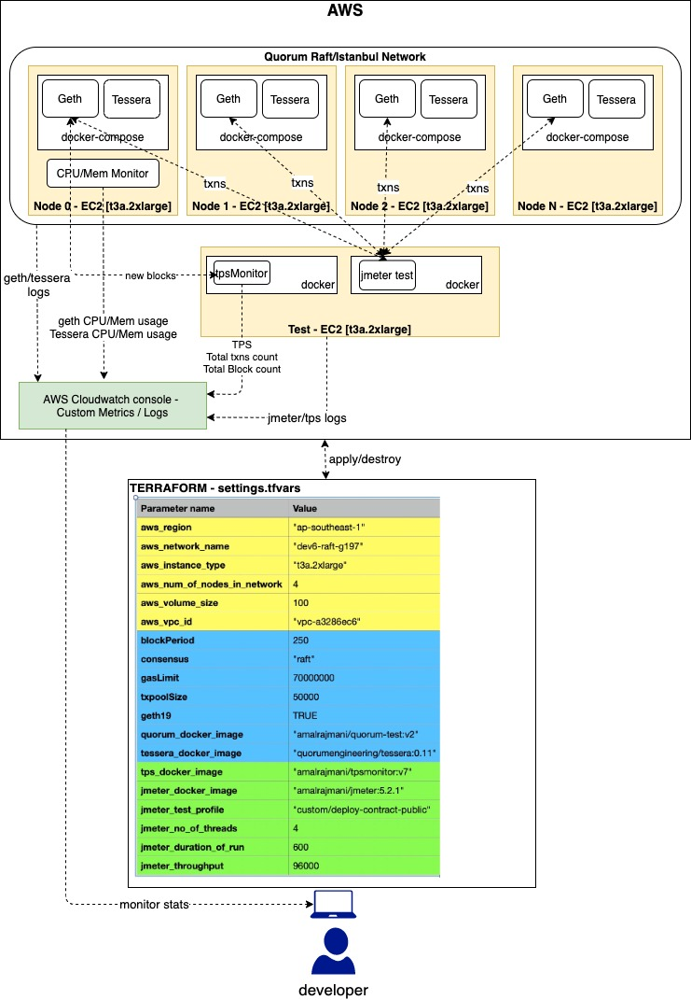

# Test Quorum in AWS
 This tool spins up a Quorum network based on the inputs given in `setting.tfvars` using `terraform` in AWS and automatically executes the `Jmeter` stress test profile as specified in the config. 
 
 The below diagram explains the overall architecture of the stress test environment that the tool will bring up:
  
 
 As depicted in the above diagram, the tool creates a `test` node (for running `Jmeter` test, `tpsmonitor`, `influxdb` and `grafana`). The logs of `geth`, `tessera`, `Jmeter` and `tpsmonitor` can be viewed under AWS `cloudwatch > Log groups > /quorum/<network_name>`
 
 Further, CPU/memory usage of first node (`node0`) and TPS metrics are pushed to AWS metrics. These metrics can be viewed under AWS `cloudwatch > custom namespaces` with namespace `<network_name>-<pulbicIp Of node0>`. The metrics names are self-explanatory.
 
## Grafana dashboard 
 The dashboard can be accessed at `http://<testNode url>:3000/login`. Enter `admin/admin`  as user id and password to access the predefined dashboards `Quorum Profiling Dashboard` & `Quorum Profiling Jmeter Dashboard`. The sample dashboards are as shown below:

## Influxdb 
 It can be access at `http://<testnode url>:8086/`. The database name is  `telegraf` and user/password is `telegraf/test123`.

## Prometheus metrics  
 * Quorum node cpu/memory usage metrics can be accessed at `http://<node url>:9126/metrics`.
 * TPS metrics can be accessed at `http://<testnode url>:2112/metrics`.
 

## Prerequisites
 Refer to **scenario 1** [here](../README.md#prerequisites-for-test-execution) for all prerequisites.
 

## Configuration details (settings.tfvars)
 - `aws_profile` = aws profile name
 - `aws_region` = aws region
 - `aws_network_name` = network name prefix. All aws resource names of this network is prefixed with this name.
 - `aws_instance_type` = aws instance type
 - `aws_num_of_nodes_in_network` = number of nodes required in the network
 - `aws_volume_size` = disk storage size(GB) of each node in the network
 - `aws_vpc_id` = aws vpc id 
 - `gasLimit` = gasLimit of genesis block and max/min gas limit passed in geth commandline for each node
 - `blockPeriod` = block period of the consensus. units: for raft treated as milliseconds and for ibft treated as seconds
 - `txpoolSize` = initialise `geth`'s `txpool.accountqueue`,`txpool.globalslots` and `txpool.globalqueue` arguments with this txpool size for each node
 -  `geth19` = specifies if Quorum is based on geth1.9.x version. This is used to specify `geth`'s commandline arguments like `--allow-insecure-unlock` that is specific to `geth1.9.x`
 - `quorum_docker_image` = Quorum docker image
 - `tessera_docker_image` = tessera docker image
 - `tps_docker_image` = tpsmonitor docker image
 - `jmeter_docker_image` = jmeter docker image
 - `consensus` = consensus to be used. It should be raft or ibft or clique
 - `enable_tessera` = bool flag to enable or disable tessera
 - `is_quorum` = bool flag to indicate Quorum geth or native geth
 - `jmeter_test_profile` = name of the test profile to be executed. Refer [Jmeter test profiles](jmeter-test/README.md) for details on various test profiles supported in the tool.
 - `jmeter_no_of_threads` = number of threads per node to be created by jmeter for the specified test profile
 - `jmeter_duration_of_run` = duration of run for the specified test profile
 - `jmeter_throughput` = specifies the number of transactions to be sent to Quorum per minute by jmeter. This is used to throttle the input. It is used by `1node` and `4node` test profiles.
 - `jmeter_private_throughput` = specifies the number of private transactions to be sent to Quorum per minute by jmeter. This is used to throttle the input. It is used by `custom/mixed` test profile described below.
 - `jmeter_public_throughput` = specifies the number of public transactions to be sent to Quorum per minute by jmeter. This is used to throttle the input. It is used by `custom/mixed` test profile described below.
### Sample config:
 ```
aws_profile = "default"
aws_region = "ap-southeast-1"
 aws_network_name = "test"
 aws_instance_type = "t2.xlarge"
 aws_num_of_nodes_in_network = 6
 aws_volume_size = 100
 aws_vpc_id = "vpc-a3286ec6"
 gasLimit = 200000000
 blockPeriod = 250
 txpoolSize = 50000
 quorum_docker_image = "quorumengineering/quorum:latest"
 geth19 = true
 tessera_docker_image = "quorumengineering/tessera:0.11"
 tps_docker_image = "quorumengineering/tpsmonitor:v1"
 jmeter_docker_image = " quorumengineering/jmeter:5.2.1"
 consensus = "raft"
 enable_tessera = true
 is_quorum = true
jmeter_test_profile = "4node/deploy-contract-public"
jmeter_no_of_threads = 1
jmeter_duration_of_run = 1200
#no of transactions to be sent per minute - for 1node and 4node test profiles
jmeter_throughput = 96000

#no of transactions to be sent per minute - only applicable for custom mixed contract test profile
jmeter_public_throughput = 12000
jmeter_private_throughput = 2400
```

**NOTE!!** To bring up a network with native geth, configure the below parameters. This will bring up a network running with `clique` consensus.
Docker image should have both `geth` and `bootnode`.
```
consensus = "clique"
enable_tessera = false
is_quorum = false
// native geth docker image, eg: ethereum/client-go:alltools-v1.9.19
quorum_docker_image = "<<native geth docker image>>"
```

## Usage
 - `git clone https://github.com/jpmorganchase/quorum-profiling.git`
 - `cd quorum-profiling/stresstest-aws`
 - edit `settings.tfvars` and configure parameters for stress test
 - Run `terraform init` to initialize
 - To start the stress test, update `setting.tfvars` with preferred config.
 Run `terraform apply -var-file settings.tfvars`. 
 - Once testing is done, destroy the environment by running `terraform destroy -var-file settings.tfvars`.


## Logs
Logs of `geth`,`tessera`, `jmeter` and `tpsmonitor` processes can be viewed under Cloudwatch Logs > log group > `/quorum/<network_name>`

## AWS - Cloudwatch metrics
 It can be viewed under AWS cloudwatch > custom namespaces with namespace `<network_name>-<pulbicIp Of node0>`. 
 The metric details are as follows:
 - `system=CpuMemMonitor`
 
 | Metric name | Description |
 | :----------- |:----------- |
 | geth-MEM% | geth memory usage |
 | geth-CPU% | geth cpu usage |
 | tm-CPU%   | cpu usage    |
 | tm-MEM%   | tessera memory usage |

 - `System=TpsMonitor`
 
 | Metric name | Description |
  | :----------- | :----------- |
  | TPS | transactions per second |
  | TxnCount  | total transactions count   |
  | BlockCount   | total block count |


## TPS Data
You can download TPS data(in .csv format) from http endpoint `http://<test node>:7575/tpsdata`
. Sample data shown below:
```
localTime,refTime,TPS,TxnCount,BlockCount
06 May 2020 10:51:01,00:00:01,722,43371,242
06 May 2020 10:51:02,00:00:02,724,86950,482
06 May 2020 10:51:03,00:00:03,724,130466,722
06 May 2020 10:51:04,00:00:04,724,173809,962
06 May 2020 10:51:05,00:00:05,723,217077,1202
06 May 2020 10:51:06,00:00:06,723,260370,1442
```

  

     