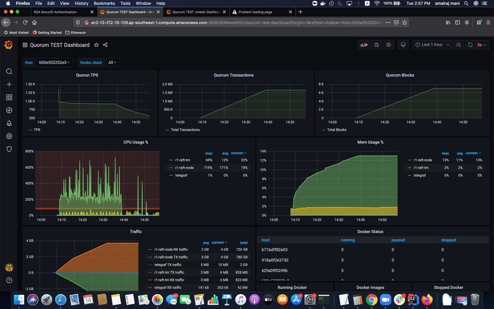
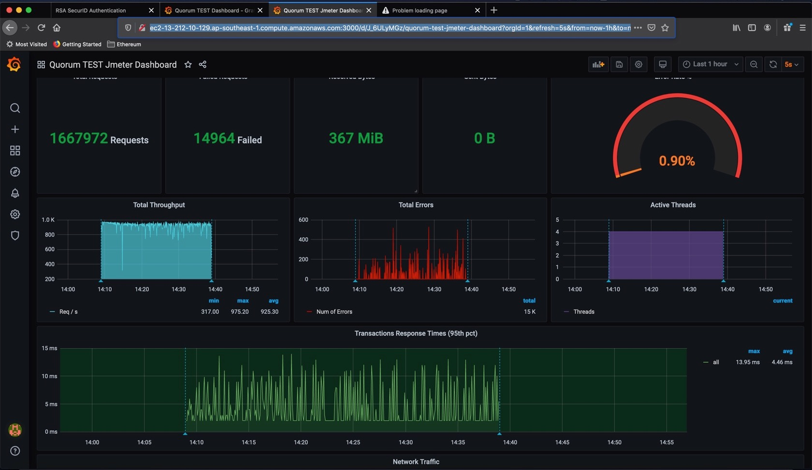
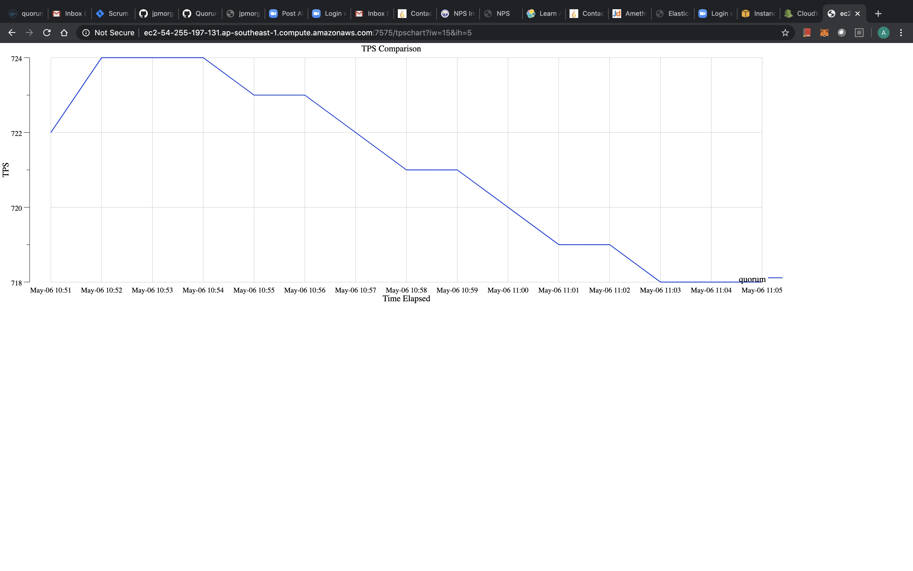

 ## Test Quorum in AWS
 This tool spins up a quorum network (based on inputs from `setting.tfvars` ) using `terraform` in AWS and runs a Jmeter stress test profile specified in the config automatically.
 
 It collects CPU & Memory usage metrics (using `telegraf`) of `geth` & `tessera` docker containers from all the nodes in the network and pushes it to `influxdb`.
 It also collects TPS, total transactions count and total block count metrics from first node(`node0`) in the network and pushes it to `influxdb`. Also, Jmeter test metrics pushed to `influxdb`.
 These metrics can be viewed in `grafana` dashboards.
 
 It creates `test` node(for running Jmeter test, tps monitor, `influxdb` and `grafana`).
 The logs of `geth`, `tessera`, `jmeter` and `tpsmonitor` can be viewed under cloudwatch > Log groups > `/quorum/<network_name>`
 
 Also, CPU/Memory usage of first node (`node0`) and TPS metrics in pushed to AWS metrics. These metrics can be viewed under AWS cloudwatch > custom namespaces with namespace `<network_name>-<pulbicIp Of node0>`. The metrics names are self-explanatory.
 
 ##### Grafana dashboard 
 It can be accessed at `http://<testNode url>:3000/login`. Enter `admin/admin` and access predefined dashboards `Quorum TEST Dashboard` & `Quorum TEST Jmeter Dashboard`
 
 ##### Influxdb 
 It can be access at `http://<testnode url>:8086/`. DB: `telegraf` user/password: `telegraf/test123`

 ##### Prometheus metrics  
 * Quorum node cpu/memory usage metrics can be accessed at `http://<node url>:9126/metrics`.
 * TPS metrics can be accessed at `http://<testnode url>:2112/metrics`.
 
 
  
 
  
 
  
 
 ### Prerequisites
 Download Terraform runtime to your machine:
 * From [HashiCorp website](https://www.terraform.io/downloads.html)
 * MacOS: `brew install terraform`
 
 terraform-provider-quorum plugin `terraform-provider-quorum_v0.1.0`:
  
  You can build it from [here](https://github.com/jpmorganchase/terraform-provider-quorum) and place under `stresstest-aws/.terraform/plugins/darwin_amd64` 
 

 ## Configuration details (settings.tfvars)
 - `aws_profile` = aws profile name
 - `aws_region` = aws region
 - `aws_network_name` = network name prefix. All aws resource names of this network is prefixed with this name.
 - `aws_instance_type` = aws instance type
 - `aws_num_of_nodes_in_network` = number of nodes required in the network
 - `aws_volume_size` = disk storage size(GB) of each node in the network
 - `aws_vpc_id` = aws vpc id 
 - `gasLimit` = gasLimit of genesis block and max/min gas limit passed in geth commandline for each node
 - `blockPeriod` = block period of the consensus. units: for raft treated as milliseconds and for ibft treated as seconds
 - `txpoolSize` = initialise `geth`'s `txpool.accountqueue`,`txpool.globalslots` and `txpool.globalqueue` arguments with this txpool size for each node
 -  `geth19` = specifies if quorum is based on geth1.9.x version. This is used to specify `geth`'s commandline arguments like `--allow-insecure-unlock` that is specific to `geth1.9.x`
 - `quorum_docker_image` = quorum docker image
 - `tessera_docker_image` = tessera docker image
 - `tps_docker_image` = tpsmonitor docker image
 - `jmeter_docker_image` = jmeter docker image
 - `consensus` = consensus to be used. It should be raft or ibft
 - `jmeter_test_profile` = name of the test profile to be executed
 - `jmeter_no_of_threads` = number of threads per node to be created by jmeter for the specified test profile
 - `jmeter_duration_of_run` = duration of run for the specified test profile
 - `jmeter_throughput` = specifies the number of transactions to be sent to quorum per minute by jmeter. This is used to throttle the input. It is used by `1node` and `4node` test profiles.
 - `jmeter_private_throughput` = specifies the number of private transactions to be sent to quorum per minute by jmeter. This is used to throttle the input. It is used by `custom/mixed` test profile described below.
 - `jmeter_public_throughput` = specifies the number of public transactions to be sent to quorum per minute by jmeter. This is used to throttle the input. It is used by `custom/mixed` test profile described below.
 #### Sample config:
 ```
aws_profile = "default"
aws_region = "ap-southeast-1"
 aws_network_name = "aj-dev2-test"
 aws_instance_type = "t2.xlarge"
 aws_num_of_nodes_in_network = 6
 aws_volume_size = 100
 aws_vpc_id = "vpc-a3286ec6"
 gasLimit = 200000000
 blockPeriod = 250
 txpoolSize = 50000
 quorum_docker_image = "quorumengineering/quorum:latest"
 geth19 = true
 tessera_docker_image = "quorumengineering/tessera:0.11"
 tps_docker_image = "amalrajmani/tpsmonitor:v1"
 jmeter_docker_image = " amalrajmani/jmeter:5.2.1"
 consensus = "raft"
jmeter_test_profile = "4node/deploy-contract-public"
jmeter_no_of_threads = 1
jmeter_duration_of_run = 1200
#no of transactions to be sent per minute - for 1node and 4node test profiles
jmeter_throughput = 96000

#no of transactions to be sent per minute - only applicable for custom mixed contract test profile
jmeter_public_throughput = 12000
jmeter_private_throughput = 2400
```

## Usage
 - `git clone https://github.com/QuorumEngineering/quorum-test.git`
 - `cd quorum-test/stresstest-aws`
 - edit `settings.tfvars` and configure parameters for stress test
 - Run `terraform init` to initialize
 - To start the stress test, update `setting.tfvars` with preferred config.
 Run `terraform apply -var-file settings.tfvars`. 
 - Once testing is done, destroy the environment by running `terraform destroy -var-file settings.tfvars`.


 ## Test Profiles
 Jmeter is used to run the test profiles. 
 The objective is to test performance and robustness of quorum under high volume of transactions over a longer duration.
To achieve this, the tests are designed in such a way to simulate high volume of transactions flowing into quorum from different nodes in the network concurrently. 
Each test profile creates one or more threads (param: `no_of_threads`) per node and runs those threads concurrently. Each thread sends transactions(create/update SimpleStorage contract as public/private) to a specified node(from default account of that node) continuously for a given period of time (param: `duration_of_run`). 
Private transactions have only one participants in `privateFor` by default.
 The private transactions are executed in each node in such a way that:
  - transaction submitted in `node0` is between `node0` & `node1`
  - transaction submitted in `node1` is between `node1` & `node2`
  - ... 
  - transaction submitted in `node[N]` is between `node[N]` and `node0`
  
 Private transactions have only one participant in `privateFor` field.
 Once the test has finished running, charts on profiles(like cpu & memory usage, tps, etc) can be saved down from AWS cloudwatch.
 
 |Profile No | Test profile name | Transaction | Description |
 | --------- | ----------------- | ----------- | ----------- |
 |1| `1node/deploy-contract-public` | create simpleStorage public contract (with constructor initialised to random number) | creates specified no of threads for first node. sends transactions to first node only. |
 |2| `1node/deploy-contract-private` | create simpleStorage private contract (with constructor initialised to random number) | same as profile `1` |
 |3| `1node/update-contract-public` | update simpleStorage public contract (with setter initialised to random number) | same as profile `1` |
 |4| `1node/update-contract-private` | update simpleStorage private contract (with setter initialised to random number) | same as profile `1` |
 |5| `4node/deploy-contract-public` | create simpleStorage public contract (with constructor - initialised to random number)| creates specified no of threads for each node (first 4 nodes only). sends transactions to first 4 nodes only. |
 |6| `4node/deploy-contract-private` | create simpleStorage private contract (with constructor - initialised to random number)| same as profile `5` |
 |7| `custom/deploy-contract-public` | create simpleStorage public contract (with constructor - initialised to random number)| creates specified no of threads and each thread will work on one of the nodes specified in the `.csv` input file. |
 |8| `custom/deploy-contract-private` | create simpleStorage private contract (with constructor - initialised to random number)| same as profile `7` |
 |9| `custom/deploy-mixed-contract` | create simpleStorage private & public contract (with constructor - initialised to random number)| creates specified no of thread pairs and each thread pair will work on one of the nodes specified in the `.csv` input file sending private and public transactions concurrently.  |

## Logs
Logs of `geth`,`tessera`, `jmeter` and `tpsmonitor` processes can be viewed under Cloudwatch Logs > log group > `/quorum/<network_name>`

## AWS - Cloudwatch metrics
 It can be viewed under AWS cloudwatch > custom namespaces with namespace `<network_name>-<pulbicIp Of node0>`. 
 The metric details are as follows:
 - `system=CpuMemMonitor`
 
 | Metric name | Description |
 | :----------- |:----------- |
 | geth-MEM% | geth memory usage |
 | geth-CPU% | geth cpu usage |
 | tm-CPU%   | cpu usage    |
 | tm-MEM%   | tessera memory usage |

 - `System=TpsMonitor`
 
 | Metric name | Description |
  | :----------- | :----------- |
  | TPS | transactions per second |
  | TxnCount  | total transactions count   |
  | BlockCount   | total block count |


### TPS Data/Chart
You can download TPS data(in .csv format) from http endpoint `http://<test node>:7575/tpsdata`
. Sample data shown below:
```
localTime,refTime,TPS,TxnCount,BlockCount
06 May 2020 10:51,00:00:01,722,43371,242
06 May 2020 10:52,00:00:02,724,86950,482
06 May 2020 10:53,00:00:03,724,130466,722
06 May 2020 10:54,00:00:04,724,173809,962
06 May 2020 10:55,00:00:05,723,217077,1202
06 May 2020 10:56,00:00:06,723,260370,1442
```
You can also view TPS graph from http endpoint `http://<test-node>:7575/tpschart?iw=15&ih=5`. 
- `iw` - width of image
- `ih` - height of image

   
 
  

     